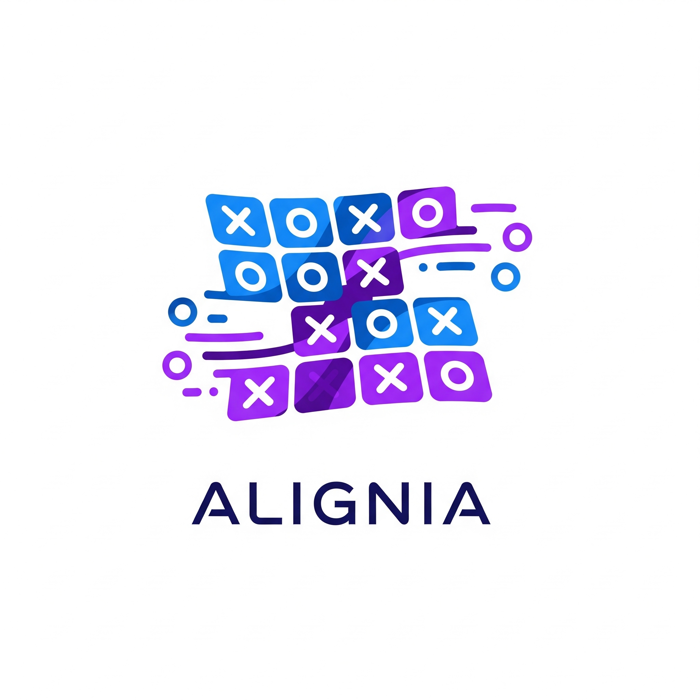

# Alignia



## Contexte du Projet

Alignia est une start-up spécialisée dans le gaming en ligne. Ce projet propose une version enrichie du Tic Tac Toe, avec une grille dynamique (n x n) et un nombre d'alignements requis pour gagner (k) personnalisables.

## Fonctionnalités

- Grille configurable (taille n x n).
- Alignement gagnant configurable (k).
- Jeu à deux joueurs avec alternance automatique.
- Détection de victoire ou match nul.
- Scores persistants via localStorage.
- Interface responsive (desktop, tablette, mobile).
- Personnalisation des symboles des joueurs.
- Boutons pour recommencer ou réinitialiser les scores.

## Technologies

- HTML5 pour la structure.
- CSS3 pour le design responsive.
- JavaScript Vanilla pour la logique et l'interaction.

## Structure du Projet

```
Alignia/
├── assets/
│   └── Alignia.png  # Logo du projet
├── index.html       # Page principale
├── styles.css       # Styles et responsive design
├── scripts.js       # Logique du jeu
└── README.md        # Documentation
```

## Installation et Utilisation

1. Clonez le repository : `git clone https://github.com/Abdelhakim-Baalla/Alignia.git`.
2. Ouvrez `index.html` dans un navigateur moderne.
3. Configurez n, k et les symboles via les settings.
4. Jouez ! Les scores sont sauvegardés localement.

ou bien allez aux : [Alignia.app](https://alignia-seven.vercel.app/)

## Bonnes Pratiques Implémentées

- Code modulaire et commenté.
- Séparation claire entre HTML (structure), CSS (style) et JS (logique).
- Responsive design avec media queries.
- Persistance des données via localStorage.

## Liens de Référence

- [Figma Design](https://www.figma.com/design/D9G8wfvC8rpbhSdqNDcorE/Alignia---design-conception?node-id=1-51&t=DnO6S6yTIpvERSPD-0)
- [Documentation Notion](https://www.notion.so/DOCUMENTATION-TECHNIQUE-ALIGNIA-27063645ae5e80888636cdefe039bdb9)
- [Jira Board](https://abdelhakimbaalla50.atlassian.net/jira/software/projects/TTT/boards/108?sprintStarted=true&atlOrigin=eyJpIjoiNWQ0Zjg0Y2FkOWMxNDM1NDgzMTg0MmQ4YmZiZTRlNjYiLCJwIjoiaiJ9)

## Contributions

Contributions bienvenues ! Ouvrez une issue ou une PR pour suggestions.

---

© 2025 Alignia. Projet pédagogique – Tous droits réservés.