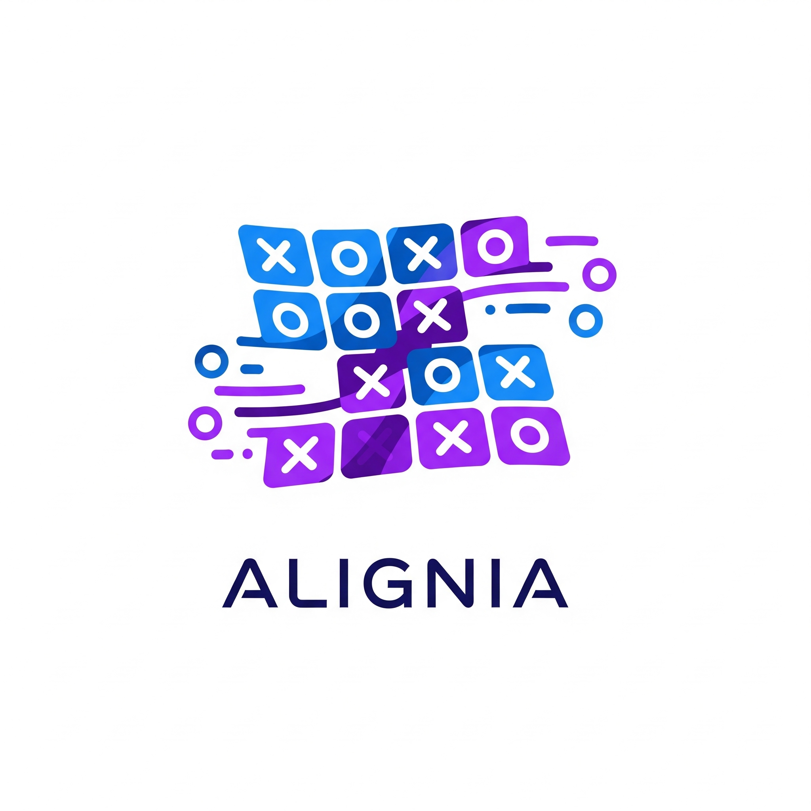

# Alignia Tic Tac Toe

## Contexte du projet

Alignia, start-up spécialisée dans le gaming en ligne, souhaite offrir une expérience enrichie de Tic Tac Toe. Ce projet propose un jeu dynamique où la taille de la grille (n x n) et le nombre d'alignements requis pour gagner (k) sont personnalisables, pour une expérience flexible et engageante.

## Fonctionnalités principales

- **Grille dynamique** : Taille configurable (n x n)
- **Alignement gagnant configurable** : Nombre d'alignements (k) paramétrable
- **Deux joueurs** : Alternance automatique, indication du joueur actif
- **Détection automatique de victoire ou match nul**
- **Scores persistants** : Stockage dans le localStorage
- **Interface responsive** : Adaptée desktop, tablette, mobile
- **Personnalisation** : Choix des symboles, configuration n et k via un menu
- **Boutons** : Recommencer la partie, réinitialiser les scores

## Technologies utilisées

- **HTML5** : Structure sémantique et minimaliste
- **CSS3** : Design moderne, responsive, flexibilité pour différentes tailles de grille
- **JavaScript Vanilla** : Logique de jeu, gestion du DOM, persistance des données

## Structure du projet

Alignia.png         # Logo ou illustration du projet
index.html          # Structure HTML principale
styles.css          # Styles et design responsive
scripts.js          # Logique du jeu, gestion du DOM, localStorage

## Organisation du code

- **Modularité** : Fonctions séparées pour la logique de jeu, l'UI et la persistance
- **Commentaires** : Explications pour faciliter la maintenance
- **Manipulation du DOM** : Pour une interface interactive et dynamique

## Utilisation

1. Ouvrir `index.html` dans un navigateur moderne.
2. Configurer la taille de la grille (n) et le nombre d'alignements (k) via le menu.
3. Choisir les symboles des joueurs.
4. Jouer en alternant les tours. Le score est affiché et persistant.
5. Utiliser les boutons pour recommencer une partie ou réinitialiser les scores.

## Bonnes pratiques

- Code commenté et structuré
- Séparation claire HTML/CSS/JS
- Utilisation de localStorage pour la persistance
- Responsive design pour tous supports

---

© 2025 Alignia. Projet pédagogique – Tous droits réservés.
